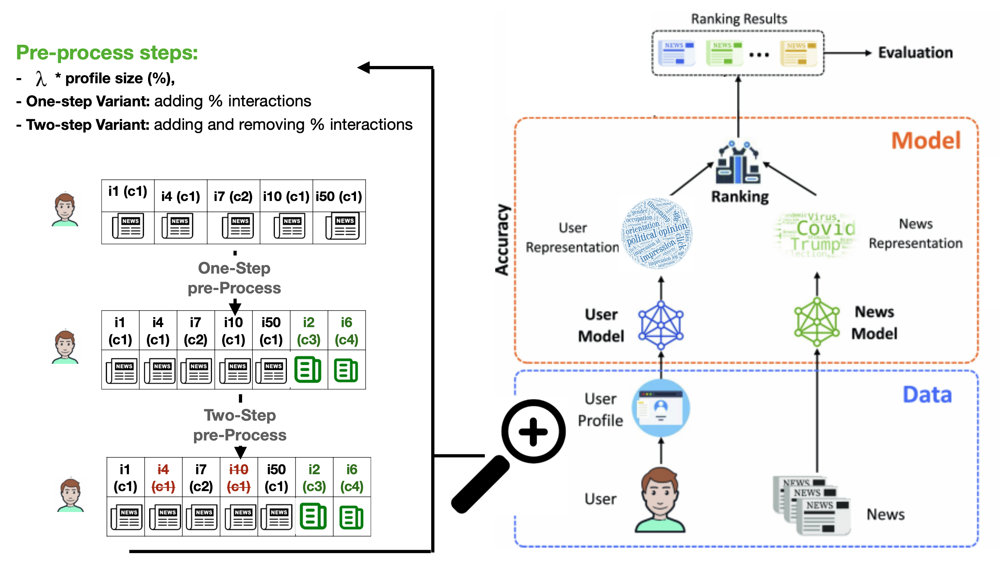

## How to Diversify any Personalized Recommender? 

In this paper, we introduce a novel approach to improve the diversity of Top-N recommendations while maintaining accuracy. Our approach employs a user-centric pre-processing strategy aimed at exposing users to a wide array of content categories and topics. We personalize this strategy by selectively adding and removing a percentage of interactions from user profiles. This personalization ensures we remain closely aligned with user preferences while gradually introducing distribution shifts. Our pre-processing technique offers flexibility and can seamlessly integrate into any recommender architecture. We run extensive experiments on two publicly available data sets for news and book recommendations to evaluate our approach. We test various standard and neural network-based recommender system algorithms. Our results show that our approach generates diverse recommendations, ensuring users are exposed to a wider range of items. Furthermore, using pre-processed data for training leads to recommender systems achieving performance levels comparable to, and in some cases, better than those trained on original, unmodified data. Additionally, our approach promotes provider fairness by facilitating exposure to minority categories.



Overall diagram for recommender system process. To the left, we zoom in on our personalized pre-processing. The one-step and two-step variants show our approach to altering the user profile. $c1$ is identified as a representative category for user $u$. $\{i1, i4, i7, i10, i50 \}$ are $u$'s past interactions. $\{c1, c2, c3, c4\}$ represent item categories. With one-step pre-processing, $i2$, and $i6$ are personalized items added to $u$ (in green). Following two-step pre-processing, $i4$ and $i10$ are removed from $u$ (in red).


## Python packages to install for recommendations:
- Lenskit (lkpy)
- recommenders (Microsoft)

## Data Sets

Our data splits and variants can be shared **on demand**. The original datasets used in our experiments can be accessed through the following sources:

- [MIND (Microsoft News Dataset)](https://msnews.github.io/)
- Goodbook website


## Citation: 
```
@article{Slokom2021PerBlur,
title = {DiverseMe: How to Diversify \texttt{any} Personalized Recommender?},
author = {Manel Slokom and Savvina Danil and Laura Hollink},
booktitle="Advances in Information Retrieval",
year="2025",
publisher="Springer Nature Switzerland",
address="Cham",
pages="--",
isbn="
}
```

# Contacts: 
Feel free to contact me at manel.slokom@cwi.nl or manel.slokom@live.fr for questions!

